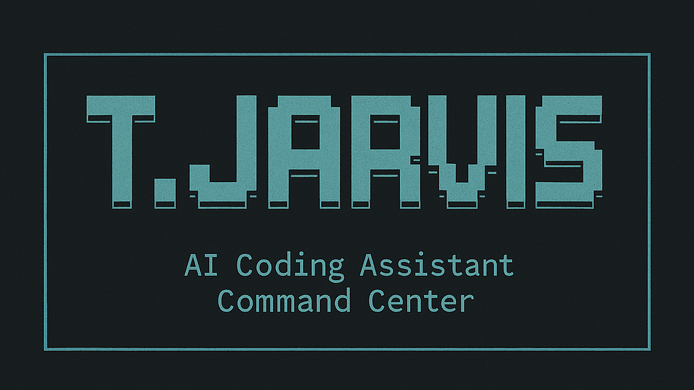

<div align="center">
  
  
  # Terminal Jarvis Landing
  
  A modern, responsive landing page showcasing Terminal Jarvis - a unified command center for coding tools.
  
  [](https://github.com/BA-CalderonMorales/terminal-jarvis)
  [](https://www.npmjs.com/package/terminal-jarvis)
  [](https://www.npmjs.com/package/terminal-jarvis)
  [](https://github.com/BA-CalderonMorales/terminal-jarvis)
  
  [](https://choosealicense.com/licenses/mit/)
  [](https://typescriptlang.org/)
  [](https://reactjs.org/)
  [](https://vitejs.dev/)
  
</div>

---

## Features

- **Responsive Design** - Optimized for mobile and desktop
- **Live Statistics** - Real-time data from GitHub and NPM APIs  
- **Interactive Navigation** - Mobile-friendly with visual feedback
- **Professional Showcase** - Clean presentation of Terminal Jarvis capabilities

## Tech Stack

- **React 19** with TypeScript
- **Tailwind CSS** for styling
- **Vite** for build tooling
- **Clean-API** for API client management

## Development

```bash
# Install dependencies
npm install

# Start development server
npm run dev

# Build for production
npm run build

# Preview production build
npm run preview
```

## Code Quality

```bash
# Lint code
npm run lint

# Fix linting issues
npm run lint:fix

# Format code
npm run format

# Check formatting
npm run format:check
```

## Project Structure

```
src/
├── api/                    # API client and types
├── components/             # React components
│   ├── SectionNavigator/   # Mobile/desktop navigation
│   ├── ToolsShowcase/      # Tools display component
│   └── TJarvisRetroLogo/   # Logo component
└── shared/                 # Shared utilities and styles
```

## License

MIT
